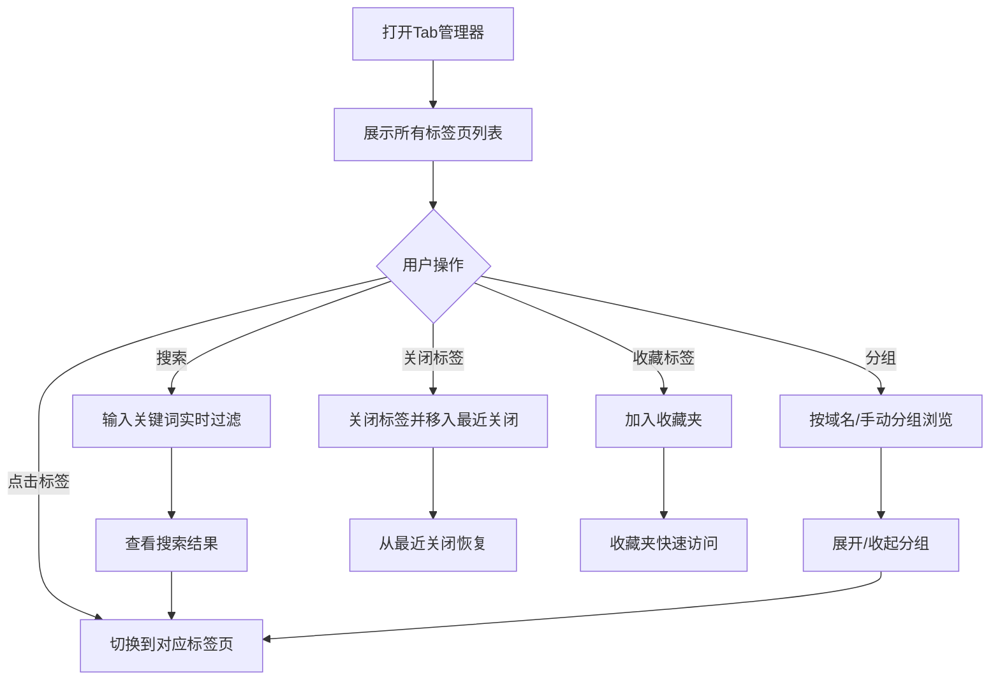

## 1. 产品概述
浏览器Tab管理器是一款帮助用户高效管理大量标签页的工具，解决了多标签页场景下查找、切换、组织困难的痛点。
- 目标用户：日常工作中需要同时打开大量标签页的用户，如研究者、内容创作者、开发者等
- 核心价值：通过搜索、分组、筛选等功能，让用户秒级定位目标标签页，提升浏览效率

## 2. 核心功能

### 2.1 用户角色
| 角色 | 注册方式 | 核心权限 |
|------|----------|----------|
| 普通用户 | 无需注册，直接使用 | 浏览、搜索、管理所有标签页 |

### 2.2 功能模块
1. **主面板**：标签页列表、搜索框、统计信息
2. **搜索过滤**：关键词搜索、按域名筛选、按时间排序
3. **分组管理**：自动按域名分组、手动创建分组
4. **标签操作**：切换标签页、关闭标签页、收藏标签页
5. **最近关闭**：查看最近关闭的标签页，支持一键恢复
6. **收藏夹**：收藏重要标签页，快速访问

### 2.3 页面详情
| 页面名称 | 模块名称 | 功能描述 |
|-----------|-------------|---------------------|
| 主面板 | 顶部导航 | 搜索框、Tab数量统计、视图切换按钮 |
| 主面板 | 标签列表 | 展示所有标签页，支持滚动浏览，悬浮高亮 |
| 主面板 | 侧边栏 | 分组导航、收藏夹、最近关闭入口 |
| 主面板 | 标签卡片 | 显示网站图标、标题、域名、关闭按钮 |
| 搜索面板 | 搜索框 | 实时搜索，支持按标题、URL匹配 |
| 搜索面板 | 搜索结果 | 高亮匹配关键词，显示匹配数量 |
| 分组面板 | 分组列表 | 按域名自动分组，可展开/收起 |
| 分组面板 | 分组操作 | 重命名分组、删除分组、新建分组 |
| 收藏夹面板 | 收藏列表 | 展示所有收藏的标签页 |
| 最近关闭面板 | 历史列表 | 按时间倒序展示最近关闭的标签页 |

## 3. 核心流程
用户打开Tab管理器后，首先看到所有标签页的列表。可以通过搜索框快速输入关键词筛选，或通过侧边栏切换分组视图。点击任意标签卡片即可切换到该标签页，也可批量关闭不需要的标签页。重要页面可加入收藏夹，误关的页面可从最近关闭中恢复。

## 4. 用户界面设计

### 4.1 设计风格
- **设计方向**：深色玻璃拟态风格，现代简约，专业高效
- **主色调**：深邃蓝紫渐变背景 (#0f0a1f - #1a1033)
- **强调色**：霓虹青色 (#00f5ff) 用于高亮和交互元素
- **辅助色**：柔和紫色 (#a855f7) 用于分组和收藏标识
- **卡片样式**：半透明玻璃卡片 (backdrop-filter: blur)，细微边框发光
- **按钮风格**：圆角胶囊按钮，悬浮时有光晕效果
- **字体**：现代无衬线字体，清晰易读
- **布局风格**：三栏布局（侧边栏 + 主内容区 + 详情区），信息密度适中
- **图标风格**：简洁线性图标，与整体风格统一
- **动效**：平滑过渡动画，悬停微交互，加载骨架屏

### 4.2 页面设计概述
| 页面名称 | 模块名称 | UI元素 |
|-----------|-------------|-------------|
| 主面板 | 顶部搜索区 | 大号搜索框、搜索图标、快捷键提示、标签数量统计 |
| 主面板 | 标签列表区 | 网格/列表双视图、标签卡片、悬浮高亮、选中态 |
| 主面板 | 侧边导航 | 分组列表、收藏夹入口、最近关闭入口、统计数据 |
| 标签卡片 | 卡片内容 | 网站favicon、标题（截断）、域名、关闭按钮、时间戳 |
| 搜索结果 | 结果展示 | 匹配关键词高亮、结果计数、分类展示 |
| 分组视图 | 分组头部 | 分组名称、标签数量、展开/收起箭头 |

### 4.3 响应性
- Desktop-first设计，主适配1440px及以上宽屏
- 支持窗口缩放，最小宽度适配到768px
- 标签列表支持虚拟滚动，性能流畅
- 触摸设备优化点击区域

### 4.4 动效与交互
- 页面加载时卡片错峰淡入动画
- 搜索输入时结果平滑过渡
- 悬停卡片时有轻微上浮和光晕
- 关闭标签时有淡出收缩动画
- 分组展开/收起有平滑高度过渡
