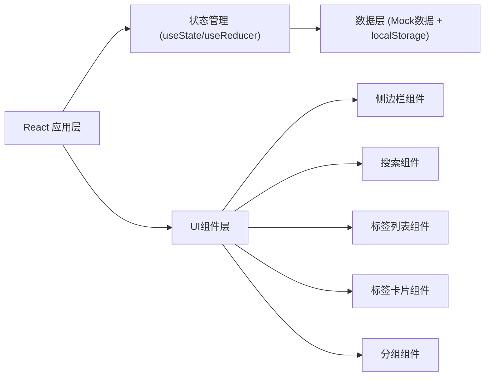

## 1. 架构设计
这是一个纯前端的Tab管理器应用，使用mock数据模拟浏览器标签页信息，无需后端服务。



## 2. 技术描述
- **前端框架**: React@18 + TypeScript
- **构建工具**: Vite@5
- **样式方案**: TailwindCSS@3
- **状态管理**: React useState + useContext
- **图标**: Lucide React
- **数据存储**: localStorage持久化 + Mock数据
- **动画**: CSS transitions + Framer Motion (可选)

## 3. 路由定义
| 路由 | 用途 |
|------|------|
| / | 主页面，展示所有标签页和管理功能 |

## 4. 数据模型

### 4.1 数据结构定义

```typescript
// 标签页类型
interface TabItem {
  id: string;
  title: string;
  url: string;
  domain: string;
  favicon: string;
  isActive: boolean;
  isPinned: boolean;
  isFavorite: boolean;
  createdAt: number;
  lastAccessed: number;
  groupId?: string;
}

// 分组类型
interface TabGroup {
  id: string;
  name: string;
  color: string;
  tabIds: string[];
  isExpanded: boolean;
}

// 应用状态类型
interface AppState {
  tabs: TabItem[];
  groups: TabGroup[];
  recentlyClosed: TabItem[];
  favorites: TabItem[];
  searchQuery: string;
  activeView: 'all' | 'groups' | 'favorites' | 'recent';
  selectedGroupId?: string;
}
```

### 4.2 Mock数据说明
- 生成50-100条模拟标签页数据
- 涵盖常见网站域名（Google、GitHub、Stack Overflow、YouTube、知乎等）
- 模拟不同的访问时间和激活状态
- 预置几个示例分组

## 5. 核心功能实现方案

### 5.1 搜索功能
- 实时搜索，防抖处理 (200ms)
- 支持标题、URL、域名多字段匹配
- 搜索结果关键词高亮
- 支持拼音搜索（可选增强）

### 5.2 分组管理
- 自动按域名分组
- 手动创建/编辑/删除分组
- 拖拽标签到分组（可选增强）
- 分组展开/收起状态持久化

### 5.3 标签操作
- 点击切换标签页（模拟高亮激活态）
- 关闭标签页（移入最近关闭列表）
- 收藏/取消收藏
- 批量关闭（可选增强）

### 5.4 性能优化
- 虚拟滚动（标签数量多时）
- 搜索结果懒加载
- React.memo优化重渲染

## 6. 组件结构
```
src/
├── components/
│   ├── Sidebar/           # 侧边栏导航
│   ├── SearchBar/         # 搜索框
│   ├── TabList/           # 标签列表容器
│   ├── TabCard/           # 单个标签卡片
│   ├── TabGroup/          # 分组容器
│   ├── StatsBar/          # 统计信息栏
│   └── ViewToggle/        # 视图切换
├── hooks/
│   ├── useTabs.ts         # 标签管理hook
│   ├── useSearch.ts       # 搜索hook
│   └── useGroups.ts       # 分组管理hook
├── data/
│   └── mockTabs.ts        # Mock数据
├── types/
│   └── index.ts           # 类型定义
├── utils/
│   ├── domain.ts          # 域名处理工具
│   └── storage.ts         # localStorage工具
├── App.tsx
├── main.tsx
└── index.css
```
